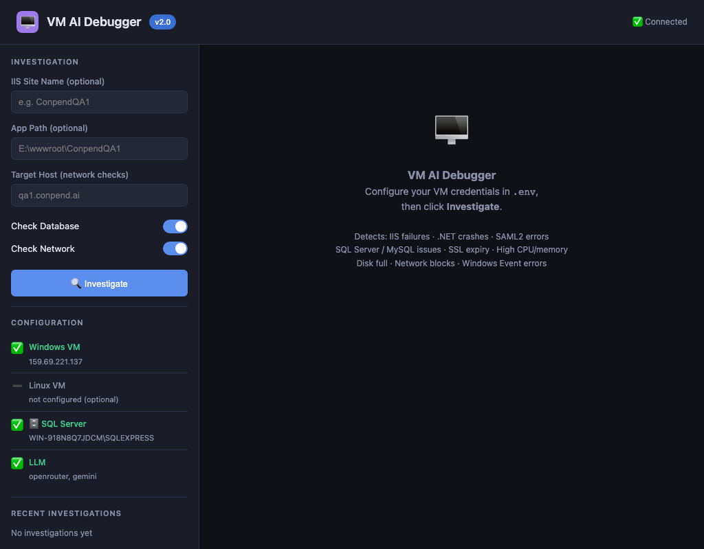

# 🖥 VM AI Debugger

AI-powered Windows and Linux VM troubleshooting with actionable fixes.

Connects to your VMs via WinRM (Windows) or SSH (Linux), collects diagnostic evidence across IIS, .NET apps, MySQL, Event Viewer, SSL, and system resources, then produces a root-cause analysis and recommended commands.

## Why this project

- Detects common Windows/Linux VM failure categories in one flow.
- Gives direct, copy-ready fix commands.
- Supports single-model and multi-model AI correlation automatically.
- Works offline after initial configuration—no cloud storage of credentials.

## Screenshots

### Dashboard Home



### Interactive API Docs


### Dashboard Tabs Overview


## Quick start

```bash
git clone https://github.com/premkumar-palanichamy/vm-ai-debugger.git
cd vm-ai-debugger
python -m venv .venv
source .venv/bin/activate
pip install -r requirements.txt
touch .env
```

Set at least one API key in `.env`:

```env
OPENROUTER_API_KEY=your_key_here
# or ANTHROPIC_API_KEY=your_key_here
# or GEMINI_API_KEY=your_key_here
```

Configure VM credentials and optional database connections:

```env
# Windows VM (WinRM)
VM_WINDOWS_HOST=192.168.1.100
VM_WINDOWS_USER=Administrator
VM_WINDOWS_PASSWORD=your_password

# Linux VM (SSH) — optional
# VM_LINUX_HOST=192.168.1.101
# VM_LINUX_USER=ubuntu
# VM_LINUX_SSH_KEY=~/.ssh/id_rsa

# MySQL — optional
# MYSQL_HOST=localhost
# MYSQL_USER=root
# MYSQL_PASSWORD=your_password
```

Run:

```bash
PYTHONPATH=. uvicorn backend.main:app --host 0.0.0.0 --port 8000 --reload
```

Open:

- Dashboard: http://localhost:8000
- API docs: http://localhost:8000/docs

## Common commands

```bash
# Start dev server
PYTHONPATH=. uvicorn backend.main:app --host 0.0.0.0 --port 8000 --reload

# Async investigation (IIS + .NET + MySQL)
curl -X POST http://localhost:8000/api/v1/investigate \
  -H "Content-Type: application/json" \
  -d '{"site_name":"ConpendQA1","app_path":"E:\\wwwroot\\ConpendQA1","target_host":"qa1.conpend.ai","check_database":true,"check_network":true}'

# Sync investigation (waits for result)
curl -X POST http://localhost:8000/api/v1/investigate/sync \
  -H "Content-Type: application/json" \
  -d '{"site_name":"ConpendQA1"}'

# Get investigation result
curl http://localhost:8000/api/v1/investigation/{inv_id}

# View investigation history
curl http://localhost:8000/api/v1/history

# Health check
curl http://localhost:8000/api/v1/health
```

## VM Setup

### Windows — Enable WinRM

Run this in PowerShell as Administrator on the target Windows VM:

```powershell
# Enable WinRM
Enable-PSRemoting -Force

# Allow unencrypted (for HTTP — use HTTPS in production)
winrm set winrm/config/service '@{AllowUnencrypted="true"}'
winrm set winrm/config/service/auth '@{Basic="true"}'

# Open firewall port
netsh advfirewall firewall add rule name="WinRM HTTP" dir=in action=allow protocol=TCP localport=5985

# Verify
winrm enumerate winrm/config/listener
```

### Linux — Enable SSH

Ensure SSH is running and accessible on the target Linux VM:

```bash
# Start SSH service
sudo systemctl start ssh
sudo systemctl enable ssh  # auto-start on reboot

# Verify SSH is listening
sudo ss -tulpn | grep :22

# Allow SSH through firewall (if using ufw)
sudo ufw allow 22/tcp

# Verify connectivity from your machine
ssh -i ~/.ssh/id_rsa user@linux_host
```

Update `.env` with SSH credentials:

```env
VM_LINUX_HOST=192.168.1.101
VM_LINUX_USER=ubuntu
VM_LINUX_SSH_KEY=~/.ssh/id_rsa
VM_LINUX_PORT=22
```

## LLM configuration

No mode switching needed. Add whichever API keys you have — the app automatically decides:

| Keys configured | What happens |
|---|---|
| 1 key | Runs that model only |
| 2 keys | Runs both in parallel — 2-way correlation |
| 3 keys | Full 3-way correlation — highest confidence |

```env
# Anthropic — direct Claude (console.anthropic.com)
ANTHROPIC_API_KEY=sk-ant-...
ANTHROPIC_MODEL=claude-sonnet-4-6

# OpenRouter — 100+ models via one key (openrouter.ai)
OPENROUTER_API_KEY=sk-or-...
OPENROUTER_MODEL=anthropic/claude-3-haiku

# Google Gemini — direct Gemini (aistudio.google.com)
GEMINI_API_KEY=...
GEMINI_MODEL=gemini-1.5-flash
```

## Multi-model ensemble

When 2 or more API keys are configured, the app automatically runs all models in parallel and correlates their diagnoses:

```
Same VM evidence
        ↓
Claude  ──┐
Gemini  ──┼──→ run in parallel → correlate → result
OpenRouter──┘
        ↓
All agree  → HIGH correlation  → confidence +20%
2 agree    → MEDIUM            → confidence +10%
All differ → LOW               → flag for human review
```

The dashboard shows individual model results with ensemble confidence scoring.

## Failure categories covered

- **IIS failures** — app pool stopped, W3SVC down, site not started
- **.NET crashes** — ASP.NET Core unhandled exception, startup failure, missing DLLs
- **SAML2 errors** — metadata file missing, wrong entity ID, SSO config error
- **SQL Server / MySQL issues** — service down, connection refused, auth failed, slow queries
- **MySQL performance** — too many connections, buffer pool full
- **High CPU** — runaway process identified
- **High memory** — memory exhaustion, OOM kill
- **Disk full** — critical usage on OS or data drive
- **SSL expiry** — certificate expired or expiring within 30 days
- **Network blocks** — port blocked, firewall rule, DNS failure
- **Windows service crashed** — service stopped unexpectedly
- **Config error** — appsettings.json misconfigured, missing env vars
- **Pending reboot** — Windows update pending restart causing instability

## Project structure

```
vm-ai-debugger/
├── backend/
│   ├── main.py               FastAPI entry point
│   ├── agents/
│   │   ├── investigator.py   evidence gathering + LLM analysis
│   │   └── ensemble.py       multi-model correlation engine
│   ├── api/
│   │   └── routes.py         HTTP endpoints
│   ├── db/
│   │   └── database.py       SQLite persistence
│   └── tools/                connector and inspector wrappers
│       ├── winrm_connector.py
│       ├── ssh_connector.py
│       ├── iis_inspector.py
│       ├── dotnet_inspector.py
│       ├── windows_events.py
│       ├── mysql_inspector.py
│       ├── system_inspector.py
│       └── network_inspector.py
└── frontend/
    └── index.html            self-contained dark mode dashboard
```

## 📝 License

MIT License

## 🌐 Connect With Me

🏠 [Portfolio](https://ladviksolutions.netlify.app/)<br>
🐙 [GitHub](https://github.com/premkumar-palanichamy)<br>
💼 [LinkedIn](https://linkedin.com/in/premkumarpalanichamy)<br>
▶️ [YouTube](https://www.youtube.com/channel/UCJKEn6HeAxRNirDMBwFfi3w)
